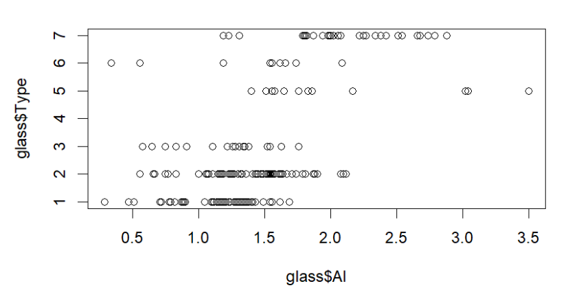
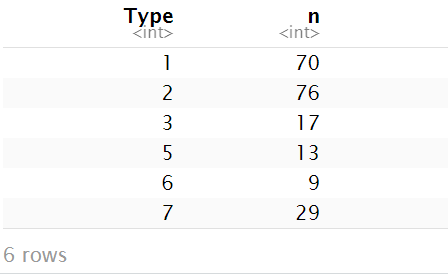
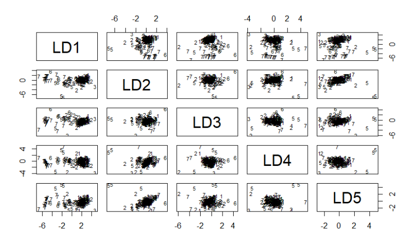
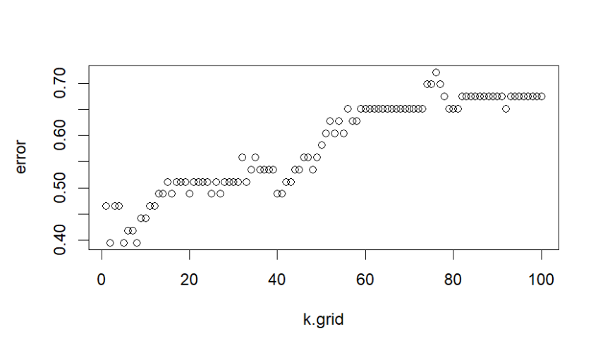

# Glass Detector Classifier Project

Glasses are made up several combination of materials and through that combination their specific shape is formed. Materials like calcium, sodium, iron and silicon are one of the examples of raw materials which are required.

# Dataset Description

In the dataset "glass.csv", 215 records are provided which form various types of glasses which are classified from 1 to 7 respectively.The column "Type" is the response variable in this dataset. Each material column has data in form of weight percentage of the material in one unit of the specific glass.

#### Installing Libraries and Uploading data

```{r}
library(tidyverse)
library(tidyr)
library(caret)
library(MASS)
library(class)

glass<- read.csv("C:/Users/USNHIT/Desktop/Machine Learning Projects/Glass Detector Project/glass.csv")

```

#### Data Cleaning

```{r}
columns_missing_values <- glass %>%
  summarise(across(everything(),~sum(is.na(.))))%>%
  pivot_longer(cols=everything(),names_to = "Column",values_to = "Missing_values")%>%
  filter(Missing_values>0)

proportion_missing <- columns_missing_values %>%
  mutate(proportion_missing = Missing_values/nrow(glass) *100)

proportion_missing
```

#### Exploratory Data Analysis

```{r}
# maximum percentage of Sodium element in every type
Sodium <- glass%>%
  group_by(Type)%>%
  summarise(max = max(glass$Na))

Sodium

plot(glass$Al,glass$Type)

#Whether data is balanced or not  
glass%>%
  group_by(Type)%>%
  count()
```

We can see from the data distribution that data is not very well-balanced as the type 1 and type 2 glasses are in large amount as compared to others.

<!-- -->
<!-- -->

#### Test/Train Split

```{r}
set.seed(101)
size_glass = round(nrow(glass)*0.20)
testing = sample(nrow(glass),size_glass)

train_glass = glass[-testing,]
test_glass = glass[testing,]
```

#### Multivariate Logistic Regression

```{r}
library(nnet)

mult.log = multinom(Type~.,data=train_glass)

summary(mult.log)$coefficients

head(predict(mult.log, newdata = test_glass,"probs"))

pred.mn = predict(mult.log,newdata = test_glass, type = "class")

confusionMatrix(factor(pred.mn),factor(test_glass$Type))


#70% accuracy 
```
```{r}

 Reference
Prediction  1  2  3  5  6  7
         1 10  5  1  0  0  0
         2  3  9  1  1  0  1
         3  0  0  0  0  0  0
         5  0  0  0  1  0  0
         6  0  0  0  0  2  0
         7  0  1  0  0  0  8

Overall Statistics
                                          
               Accuracy : 0.6977          
                 95% CI : (0.5387, 0.8282)
    No Information Rate : 0.3488          
    P-Value [Acc > NIR] : 3.364e-06       
                                          
                  Kappa : 0.5794          
                                          
 Mcnemar's Test P-Value : NA

```

I have applied first multivariate logistic regression model. Our overall test accuracy is 70% approximately and as our data is unbalanced, majority of errors we have got in predicting type 2 glass as type 1.

To further evaluate, we can use Linear discrimnant analysis to find how much easier the type of each glass is classified through their discriminant score based on means of variable and the pooled covariance matrix of the variables.


#### Linear Discriminant Analysis

```{r}
# LDA 

lda_glass <- lda(Type~.,data = train_glass)
lda_glass


plot(lda_glass)

lda_pred = predict(lda_glass,newdata =test_glass)

table(test_glass$Type, lda_pred$class)

confusionMatrix(as.factor(test_glass$Type),lda_pred$class)

#72% accuracy 

#Cross Validation

#lda_cv_glass <- lda(Type~.,CV=TRUE,data= glass,subset = -testing)

#lda_cv_glass


```
<!-- -->

```{r}

Reference
Prediction  1  2  3  5  6  7
         1 10  2  1  0  0  0
         2  2 12  1  0  0  0
         3  0  1  1  0  0  0
         5  0  2  0  0  0  0
         6  0  1  0  0  1  0
         7  1  1  0  0  0  7

Overall Statistics
                                          
               Accuracy : 0.7209          
                 95% CI : (0.5633, 0.8467)
    No Information Rate : 0.4419          
    P-Value [Acc > NIR] : 0.0001977       
                                          
                  Kappa : 0.6103          
                                          
 Mcnemar's Test P-Value : NA             

```
In the Linear Discriminant Analysis (LDA), our test accuracy has been improved by 3% from logistic regression. Further, our wrong predicted are also balanced in this model. The major concern to consider it as optimal model is that our test data is very less to finalize our optimal model.

#### KNN Algorithm

```{r}
knn_glass_train = train_glass[,-ncol(train_glass)]
knn_glass_test = test_glass[,-ncol(test_glass)]
knn_glass_train_labels = train_glass[,ncol(train_glass)]
knn_glass_test_labels = test_glass[,ncol(test_glass)]

knn3 = knn(train = knn_glass_train, test = knn_glass_test, cl = knn_glass_train_labels, k=3)

confusionMatrix(knn3,as.factor(knn_glass_test_labels))

```

```{r}

Confusion Matrix and Statistics

          Reference
Prediction 1 2 3 5 6 7
         1 9 4 1 0 0 1
         2 3 8 0 0 0 1
         3 1 2 1 0 0 0
         5 0 0 0 2 0 0
         6 0 1 0 0 1 0
         7 0 0 0 0 1 7

Overall Statistics

In this step, I have tested my dataset through KNN and found that our test accuracy is decreased. One of the reasons can be that our dataset is too much complex as it 7 different type of glasses. And, the best K value can be found as 1 or 2 through the following graph. As the K value is very less, there is a chance of high variance in the dataset.

```
#### Choosing the optimal K with error

```{r}
set.seed(1234)
k.grid=1:100
error=rep(0, length(k.grid))

for (i in seq_along(k.grid)) {
  pred = knn(train = scale(knn_glass_train), 
             test  = scale(knn_glass_test), 
             cl    = knn_glass_train_labels, 
             k     = k.grid[i])
  error[i] = mean(knn_glass_test_labels !=pred)
}

min(error)

plot(k.grid,error)


```
<!-- -->
#### Overall Summary till this point

The reason for getting higher accuracy in logistic regression as compared to KNN can be because of high dimensionality in the data set. The second reason can be because the model follows a linear relationship and logistic regression performs well in that. Logistic regression can benefit from feature selection and regularization techniques to handle irrelevant features. As compared to the KNN, it follows a non-parametric method. This can also be a reason that our data set size is small and logistic regression performs well in that.


#### Bagging & Random Forest

```{r}
set.seed(123)
library(ipred)
model.bag=bagging(factor(train_glass$Type) ~ ., data=train_glass, coob = TRUE)

print(model.bag)

pred.bag = predict(model.bag,newdata=test_glass, type = "class")

# Calculate the confusion matrix for the test set
confusionMatrix(factor(pred.bag, levels = 1:7),
                factor(test_glass$Type, levels = 1:7))


```

```{r}
Bagging classification trees with 25 bootstrap replications 

Call: bagging.data.frame(formula = factor(train_glass$Type) ~ ., data = train_glass, 
    coob = TRUE)

Out-of-bag estimate of misclassification error:  0.2982 

Confusion Matrix and Statistics

          Reference
Prediction  1  2  3  4  5  6  7
         1 10  5  0  0  0  0  1
         2  3 10  0  0  1  0  0
         3  0  0  2  0  0  0  0
         4  0  0  0  0  0  0  0
         5  0  0  0  0  1  0  0
         6  0  0  0  0  0  2  0
         7  0  0  0  0  0  0  8

Overall Statistics
                                          
               Accuracy : 0.7674          
                 95% CI : (0.6137, 0.8824)
    No Information Rate : 0.3488          
    P-Value [Acc > NIR] : 2.505e-08       
                                          
                  Kappa : 0.6812          
                                          
 Mcnemar's Test P-Value : NA       

```
Overall, through Bagging our test accuracy has significantly increased making it overall 76%. Further, we can evaluate our model with Random Forest as it the extension of Bagging.


```{r}
Confusion Matrix and Statistics

          Reference
Prediction  1  2  3  4  5  6  7
         1 11  5  0  0  0  0  1
         2  2 10  0  0  0  0  1
         3  0  0  2  0  0  0  0
         4  0  0  0  0  0  0  0
         5  0  0  0  0  2  0  0
         6  0  0  0  0  0  2  0
         7  0  0  0  0  0  0  7

Overall Statistics
                                          
               Accuracy : 0.7907          
                 95% CI : (0.6396, 0.8996)
    No Information Rate : 0.3488          
    P-Value [Acc > NIR] : 3.86e-09        
                                          
                  Kappa : 0.715           
                                          
 Mcnemar's Test P-Value : NA 

```

By applying Random Forest, we have concluded our test accuracy to rise up to 79% which is quite optimal. Now, for further testing, we have to find a procedure through we can balance our dataset.

#### Conclusion

Overall, our test accuracy has been increased to 81% in total which is acceptable as our number of records are not much. For further, we can apply Synthetic Minority Oversampling Technique (SMOTE) to balance the training dataset and then evaluate the model as records with miniority data will be equally weighted through it.


